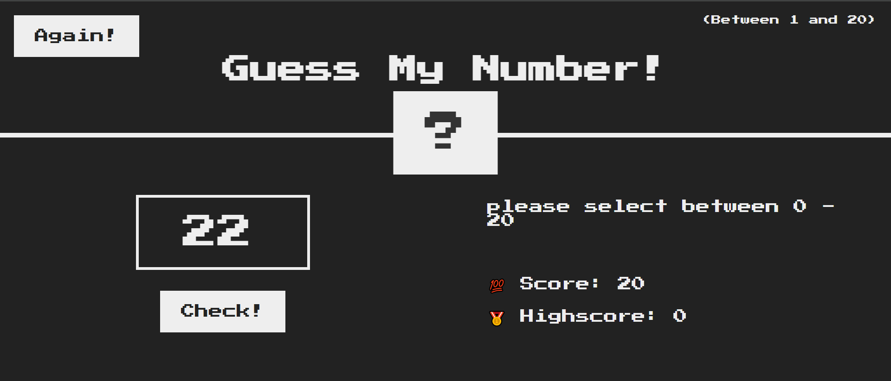

# 🎯 Guess My Number - JavaScript Game

A fun, interactive game built using **HTML**, **CSS**, and **JavaScript** where you try to guess a randomly generated number between 1 and 20.

---

## 🚀 Live Demo

[guess-the-number-ten-eta.vercel.app](#)

---

## 📸 Screenshot

---

## 🛠️ Features

- 🎲 Random number generation between 1 and 20
- ⌨️ User input to guess the number
- 💡 Feedback messages (Too high, Too low, Correct!)
- 🟩 Color change on correct guess
- 🔁 "Again" button to restart the game
- 🏆 Tracks and updates the high score

---

## 📂 Project Structure
